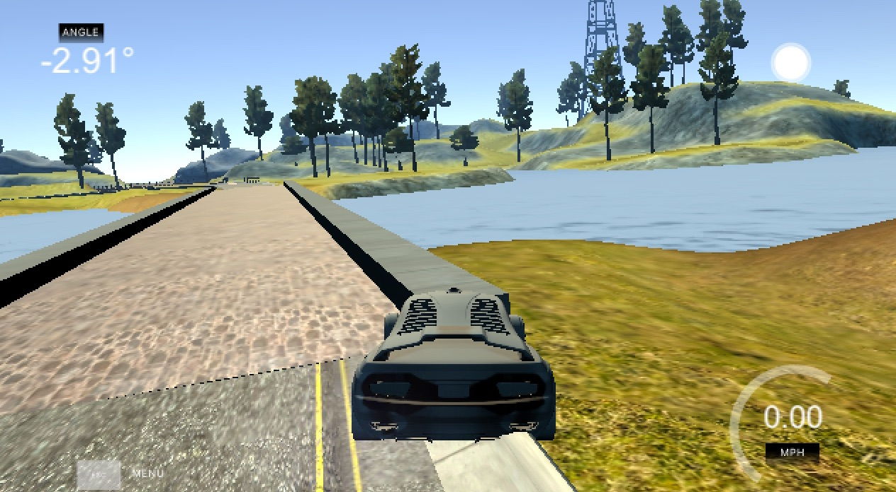
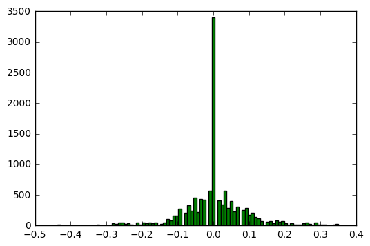
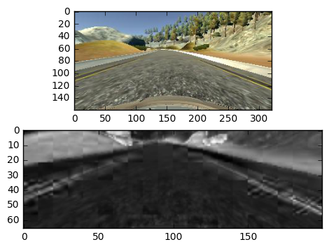

## Udacity Self-Driving Car Nanodegree

# Project 3 - Behavioral Cloning




## 1. Getting Data

I started with the Udacity data set. The problem with this data is that it has excess zero-angle samples and a lot of jumps
to zero (actually gaps in data). This is probably because of the recording method, which does not correspond to real driving conditions.

Because of that, I soon ended up recording data myself. Luckily I had access to PS3 controller, which I could pair with my MacBook. 
First I recorded two laps, one each direction. The final data-set consists of images of four full laps, two clockwise and
two counter-clockwise. This gives rather even distribution of data. Also, joystick does not produce so many 'returns to zero' as keyboard does.

Altogether the dataset consisted of 12,384 images. There was still many zero-angle images and images very close to zero-angle.
The histogram below illustrates the distribution of steering angles in the data.



The amount of left and right turns vs. straight driving samples

* Zeroes [-0.01,0.01]: 3400
* Left [-1.0, 0.01]: 4370
* Right [0.01, 1.0]: 4614

The total sum on steering angles tells that there are a little bit more or steeper right turns than left turns.

* Sum left angles: -363.93844251
* Sum right angles: 404.24960682


## 2. Data Pre-Processing

The motivation for collecting a large data set was, that one could avoid data augmentation. Although very useful in a general case,
augmentation would not be necessary in this special case if the data covered large enough set of situations. 

First step of pre-processing was done to image list (driving_log.csv). All images that had larger steering angle than abs(0.5) were remove.
There was only a few of those. These situations were human errors in operating joystick.


During the project, several pre-processing techniques were considered:
* Brightness equalisation. This was done in YCrCB space (later also HSV). Equalisation increases contrast of the picture
radically and makes the road area very distinct and easily observable for a human eye.
* Using only the luminance channel of the image. There are enough details in monochromatic image.
* Random brightness variations in order to handle different lightning situation.
* Using HSV image instead of RGB
* Cropping: crop area was first 90x270 pixels area. Upper left corner where the crop was taken was (25,45). This removed quite 
of amount of sky and forest above the horizon, and the lowest part of the image.   
* Shifting image horizontally and adjusting steering angle accordingly. This was implemented by varying the position of cropping in 
the original image. This could have been used for image augmentation was, but the final model did not utilize the method.
* Resizing: the very first model used 16x48 images resized from 90x270 crops.
* Random image flipping: Although there was about the same amount of left and right turns in the data set, random flipping was added,
in order to guaranteed that there is not unnecessary bias on single training batches.


The final version uses following image pre-processing. All this is done 'on the fly' via data generator (see below):
* Cropping: final crops have size of 90x320 and taken from point (50,0) of the camera image. Full width allows the model to 
use the whole width (road area) of the original image.
* The crop of 90x320 are resized to 66x200, which is the original NVIDIA size. 
* Converting RGB to HSV colour space, and reducing image size to saturation channel only (monochromatic).
Using HSV was empirically observed to be best approach and saturation channel alone gave equally good results. 
Because of this, brightness variations of the image became obsolete.
* Normalising values to [-0.5,0.5]. A good practice to the mean of training data close to zero. This could have been done in Keras model,
but because I was not using GPU, I'd like to do it separately and have better control to what is happening (for example can preview the images that come out of the preprocessing.)
* Flipping


Below is a sample camera picture and the corresponding preprocessed data frame.




## 3. The Model

I started with a small model with one convolutional layer and a couple of fully connected layers. At the same time,
however, I was struggling with data preprocessing and data quality issues. So very soon I turned to proven solution described in 
[NVIDIA's blog](https://devblogs.nvidia.com/parallelforall/deep-learning-self-driving-cars/) and 
[the research paper](https://arxiv.org/pdf/1604.07316v1.pdf). 

Keras was used to implement the model.

During the process I also tried adding dropouts, pooling layers and L2-regularisers. Dropout was added after 
the last convolutional layer. It was removed later, because the produce model performed better without it. 
Also regularisers were removed, because those seem to have no effect to the trained model. Same was with
pooling layer.

Also (3,1,1) input layer was tested. This should have been helped with colour images to detect the best color
plane by the network. But the layer did not improve the performance of this network.

The final CNN corresponds quite closely to the original from NVIDIA. The input is different, because I used
monochromatic images. The model used mean squared error as loss function,
and Adam optimiser with default learning rate as starting point.

NVIDIA model as printed from Keras model.summary()

```
Layer (type)                     Output Shape          Param #     Connected to                     
====================================================================================================
convolution2d_1 (Convolution2D)  (None, 31, 98, 24)    624         convolution2d_input_1[0][0]      
____________________________________________________________________________________________________
activation_1 (Activation)        (None, 31, 98, 24)    0           convolution2d_1[0][0]            
____________________________________________________________________________________________________
convolution2d_2 (Convolution2D)  (None, 14, 47, 36)    21636       activation_1[0][0]               
____________________________________________________________________________________________________
activation_2 (Activation)        (None, 14, 47, 36)    0           convolution2d_2[0][0]            
____________________________________________________________________________________________________
convolution2d_3 (Convolution2D)  (None, 5, 22, 48)     43248       activation_2[0][0]               
____________________________________________________________________________________________________
activation_3 (Activation)        (None, 5, 22, 48)     0           convolution2d_3[0][0]            
____________________________________________________________________________________________________
convolution2d_4 (Convolution2D)  (None, 3, 20, 64)     27712       activation_3[0][0]               
____________________________________________________________________________________________________
activation_4 (Activation)        (None, 3, 20, 64)     0           convolution2d_4[0][0]            
____________________________________________________________________________________________________
convolution2d_5 (Convolution2D)  (None, 1, 18, 64)     36928       activation_4[0][0]               
____________________________________________________________________________________________________
activation_5 (Activation)        (None, 1, 18, 64)     0           convolution2d_5[0][0]            
____________________________________________________________________________________________________
flatten_1 (Flatten)              (None, 1152)          0           activation_5[0][0]               
____________________________________________________________________________________________________
dense_1 (Dense)                  (None, 100)           115300      flatten_1[0][0]                  
____________________________________________________________________________________________________
activation_6 (Activation)        (None, 100)           0           dense_1[0][0]                    
____________________________________________________________________________________________________
dense_2 (Dense)                  (None, 50)            5050        activation_6[0][0]               
____________________________________________________________________________________________________
activation_7 (Activation)        (None, 50)            0           dense_2[0][0]                    
____________________________________________________________________________________________________
dense_3 (Dense)                  (None, 10)            510         activation_7[0][0]               
____________________________________________________________________________________________________
activation_8 (Activation)        (None, 10)            0           dense_3[0][0]                    
____________________________________________________________________________________________________
y_pred (Dense)                   (None, 1)             11          activation_8[0][0]               
====================================================================================================
Total params: 251,019
Trainable params: 251,019
Non-trainable params: 0
```

## 4. The Generator

There is a data generator implementation. The generator produces one training batch from the data set, and 
yields it to the model. Center camera images are processed a little bit differently than side camera images
(see Training below). Because of this the generator has an input parameter to tell what camera images are produced.
Also, the same generator can be used to produce validation data.

The list of images and the corresponding steering angles are loaded into the memory before training starts. The 
generator maintains an index array to this list. The index array is first shuffled, and again when the whole
image list has been processed. In the generator loop, preprocessed images are retrieved and placed into the batch array.
When a whole batch is generated, it is given to the model.


## 5. Training

After numerous trials and errors, the following training method was used:

1. First train the model using (almost) all center images (1 epoch only). 
2. Test the model how good it performs on a simulator. The model is saved after each epoch.
3. Do some thinking, adjust parameters (mainly image preprocessing, image sampling), and  iterate 1. and 2.
4. After a well performing model has been found (it is the car can drive up to the bridge or over it), start training
recovery (back to the center lane) behaviour. Use side camera images for that. Training is done by fine-tuning the 
model from step 1-3.
5. Stop when the car passes both tracks (without too much swinging from side to side)

Steps 4 and 5 should add the ‘return to center’ behaviour to the model with the help of left and right cameras. 
In this phase I had to adjust two things. 
First, the steering angle adjustment of the camera image, and secondly the amount of batches/epochs to add to original model.

It was quite easy to add the recovery feature by adding big enough shift to the angle (to the opposite direction). However this 
easily made the car squirm around on the straight road. Remedy to this was to proportionally adjust the angle
depending on the original steering angle. The bigger the angle the larger the adjustment. And other way round, on the straight 
section, there should be very little adjustment.  

```
camera_corr = abs(angle) * np.random.uniform(2.0,4.0)
# left camera: pos==0, right camera: pos==2
 angle = angle +  (pos * -camera_corr + camera_corr)
``` 

The other question was, how to train for the recovery. Surprisingly only one epoch and 1/4 of the training data was needed.
- this is 1/8 of left camera and 1/8 of right camera images. It is randomly selected in the generator
which on of the side cameras to use.


## 6. Validating and Testing

Initially, I used validation data set for tracking how well augmented data matched to original data set, and to find out which is the best training epoch. When image size was 90x270, randomly shifted crops were selected to validation data set.

After moving to 90x320 images, no shifted images were used. Also, at this point was quite clear, that only one epoch of all images is 
enough to produce the basic weight set, so no validation was needed.

The model was validated on the training track. And also tested on the testing track. When the car could drive autonomously both tracks, the
model was assumed good enough. 

If programmatic validation is needed, the augmentation is easily added to the generator.


## 7. Code and Files

- `nvidia_keras.ipynb`: Jupiter Notebook that contain all kind of experiments, but also the code that was used to produce the model.
- `model.py`: the code that produced the model. **NOTE:** This code has not been run ever from this file! The content is extract from `nvidia_keras.ipynb` only to clarify which part of the notebook code contributes to the model.
- `drive.py`: Data producer for the simulator, originally from Udacity. I added some image preprocessing and naive dynamic throttling, which tries 
to keep steady 20 mph speed (without too much luck  - more serious effort is needed here)
- `model.json`: loadable Keras model
- `model.h5`: weights for the model


## 8. Conclusion

The project required a lot of work, and moments of despair could not have been avoided. On the other hand, it also taught
many things. I have enjoyed the numerous blog posts of the fellow students and all slack conversations. It is wonderful how the
same goal can be achieved in so many ways. The importance of good quality data, and reuse of existing 
neural network architectures are two big things to take home.

